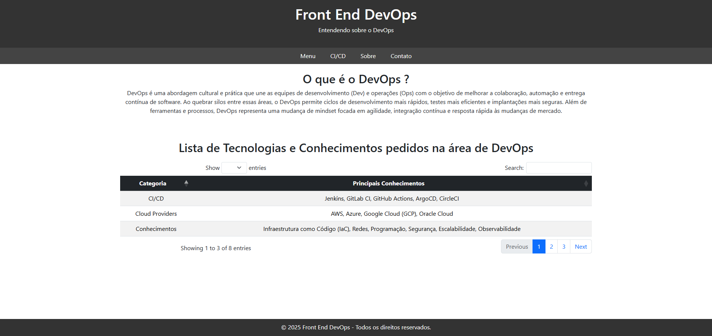

# FrontEnd DevOps
          


<p align="center">

</p>

## 📂 Menu

<ul>
    <li><a href="#descricao">Meta e Descrição</a></li>
    <li><a href="#funcionamento">Funcionamento</a></li>
    <ul>
        <li><a href="#ci">Funcionamento do CI</a></li>
        <li><a href="#cd">Funcionamento do CD</a></li>
    </ul>
    <li><a href="#perfil">Perfil</a></li>
    <li><a href="#mapa">Mapa do Projeto</a></li>
    <li><a href="#contributing">Contributing</a></li>
</ul>

<p id="descricao"></p>

## 🎯 Meta e Descrição

*Projeto desenvolvido em equipe.*
> Página web desenvolvida para estudos e compreensão de tecnologias utilizadas no mercado.
O foco do projeto é desenvolver um website responsivo com frameworks como SASS e DataTables, para desenvolvimento completo do projeto, até seu deploy na fase final. Além disso é utilizado cypress para automação de testes de uso da página.

<p id="funcionamento"></p>

## ⚙️ Funcionamento

<p id="ci"></p>

### 🔁 Funcinamento do CI

<p id="cd"></p>

### 🚀 Funcionamento do CD

<p id="perfil"></p>

## Perfil

[Meu perfil do Github](https://github.com/Gabriel-Dev-C/)

<p id="mapa"></p>

## 🗺️  Mapa do Projeto

```.
├───.github\workflows       //Pasta com os arquivos yml para a execução do CI e do CD
└───cypress        //Pasta com os arquivos de configuração do cypress
└───src            //Pasta com os arquivos do site
    └───images      //Pasta com as imagens do README.md
```

<p id="contributing"></p>

## 🤝 Contributing

1. Fork it (<https://github.com/Gabriel-Dev-C/DevOps-Projeto/fork>)
2. Create your feature branch (`git checkout -b feature/fooBar`)
3. Commit your changes (`git commit -am 'Add some fooBar'`)
4. Push to the branch (`git push origin feature/fooBar`)
5. Create a new Pull Request
